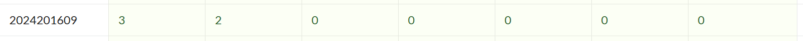

# bomblab 报告

姓名：许碧涛

学号：2024201609

| 总分 | phase_1 | phase_2 | phase_3 | phase_4 | phase_5 | phase_6 | secret_phase |
| --------- | ------------- | ------------- | ------------- | ----------------- |-----------|-----------|-----------|
| 3        | 2          | 0            | 0            | 0 |0  |0  |0  |


scoreboard 截图：



<!-- TODO: 用一个scoreboard的截图，本地图片，放到 imgs 文件夹下，不要用这个 github，pandoc 解析可能有问题 -->

## 解题报告

<!-- 对你拆掉的每个phase进行分析，并写出你得出答案的历程 -->

<!-- 如果能用伪代码还原题目源代码最佳（不属于先前提到的大段代码），语言描述自己的分析也可，每道题目的图片不建议超过两张 -->

### phase_1

```c
Can you see the meaning inside yourself? Can you see the meaning in your true destiny?
```

讲解题目思路
找到explode_bomb的调用，在这步之前发现string_not_equal辅助函数的调用。只有string_not_equal的结果为0(字符串相等)才能够跳过爆炸。因此通过gdb调试，事先“偷看”%rsi寄存器中的内容(即答案字符串)，得到正确答案。

关于爆炸3次，由于刚开始断点操作不太熟悉没有像后续在explode_bomb打断点，比较滑稽的是偷看到答案后是带有双引号的字符串，我直接把它放到了input中导致bomb，我以为是在汇编理解层面的问题或者是复制粘贴，于是反复几次bomb(有点心态炸了)。


### phase_2

```c
1140620 740650 1676859 1030861
```

这个phase利用两个预设的矩阵 matA 和 matB 进行运算，并将运算结果与用户输入的数字进行比对。如果不匹配，则bomb。直接去找matA和matB的结构手动进行矩阵运算是及其复杂的(根据结果来看还好没这么做)，不如直接在每次循环中“偷看”一个位置上的运算结果的值，最后得到答案

### phase_3

```c
0 I 981
```

这个phase需要三个参数，第一个参数作为跳转表的索引，决定了参数三的值。我第一次尝试为索引0，其对应的参数三在汇编中有cmp指令0x3d5(981)。而参数二涉及一个Xor操作，偷看了Xor结果和mask通过逆运算确定了参数二应为0x49("I")。

### phase_4
```c
31 AC
```
初步判断这个phase需要两个输入，第一个输入是一个由辅助函数func4_1决定的一个数字，第二个输入需要与辅助函数func4_2生成的字符串进行匹配(有初步要求字符串长度是2)。
分析 func4_1 的递归逻辑，可得到如下递推关系：

$$
f(1)=1,\quad f(n)=2f(n-1)+1
$$

在 phase_4 中调用 $f(5)$，递推计算结果为 $31$。
分析func4_2的字符串生成逻辑有些复杂，仍采用“偷看”的方式：在字符串比较之前打印寄存器%rsi中的字符串，得到“AC”。

### phase_5

```c
-7 60
```

这个phase是在一个数组上进行mol 16的方式跳转走到终点的过程。要求走9步到达“15”的位置，要求我输入起始位置的索引和路径上的数字总和。
索引的必须要求：必须为负数且mol 16！=15，否则就会bomb。其次进行数组的确定，通过“偷看”到数组的基址后，得到大小为16的数组：十六个数分别是 a,2,e,7,8,c,f,b,0,4,1,d,3,9,6,5。我们的目标就是“f”(15)，根据刚开始得到的逻辑以及尝试我们应该从倒数第七个位置(4)开始，经过9步到达f，进行求和后得到60。

### phase_6

```c
3 1 6 4 5 2 unlock(secret_phase password)
```

这个phase是对链表元素中按大小进行排序后，在7-index得到6个索引作为期望的输入。首先获得6个node的值，通过偷看到起始元素后通过+16一步步得到不同node的值(印象中刚开始是从+8开始尝试的，两次+8得到node2于是改为+16，而且关于node6需要多一步操作)
将 6 个节点的值整理如下表：
| node1 | 0x312 | 0x1 |
| node2 | 0x217 | 0x2 |
| node3 | 0x2d2 | 0x3 |
| node4 | 0x3d4 | 0x4 |
| node5 | 0x11b | 0x5 |
| node6 | 0x313 | 0x6 |
进行排序及后续的一步操作后得到答案 3 1 6 4 5 2

### secret_phase

```c
unlock
cccaa
```
进入secret_phase，在整个asm文件中CTRL+F查找secret_phase发现secret_phase在phase_defused中出现，仍然是一个string_not_equal的逻辑，偷看寄存器得到密码“unlock”(一看就稳了)。于是成功进入到secret_phase。
成功进入后，secret_phase是一个马走迷宫的操作，要求我们从(0,0)走到(4,7)。
首先确定输入什么来进行移动操作，逻辑对输入进行一个与7操作保留最后三位得到索引到查找表上进行对应的移动操作 c->索引3->移动操作(1,2) a->索引1->移动操作(2,-1)。
其次就是试：由于fun7是一个递归函数，如果没有到达终点或者越界行为(这种情况会爆所以事先给explode_bomb打了断点)就会反复调用，所以在fun7处打断点，每次continue之后看一下(x,y)坐标决定下一步操作，最后完成了这个phase。


## 反馈/收获/感悟/总结

这一节是越做越能发现乐趣的过程，由于刚开始对gdb操作的不熟悉，总是担心bomb(虽然还是bomb了)，担惊受怕地看着炸弹爆炸，到后来gdb操作熟悉之后更能专注于对phase逻辑的分析，解phase的过程中也会走一些偷看的捷径，最终phase_defused的各种小句子带来的成就感确实很好。
besides，CTRL+C的小彩蛋也很有趣。

<!-- 这一节，你可以简单描述你在这个 lab 上花费的时间/你认为的难度/你认为不合理的地方/你认为有趣的地方 -->

<!-- 或者是收获/感悟/总结 -->

<!-- 200 字以内，可以不写 -->

## 参考的重要资料

<!-- 有哪些文章/论文/PPT/课本对你的实现有重要启发或者帮助，或者是你直接引用了某个方法 -->
- CS:APP
- [bilibili Linux 使用gdb调试入门](https://www.bilibili.com/video/BV1Kq4y1D7n2/?spm_id_from=333.337.search-card.all.click&vd_source=cf91d103de88c6efe6860e12de33503e)
<!-- 请附上文章标题和可访问的网页路径 -->
